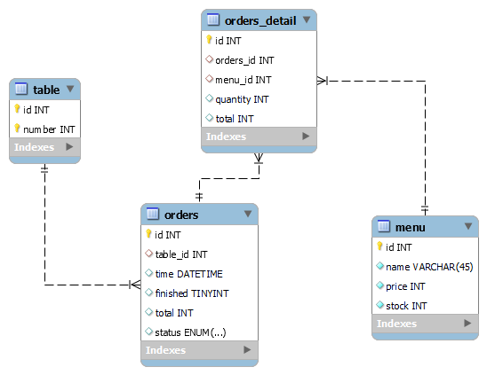

# Jawaban Soal No 1

## Alasan menggunakan database relasional (Mysql)

- Database relasional memiliki struktur yang terorganisir dengan baik, sehingga memudahkan dalam mengelola data.
- Database relasional memiliki fitur yang lengkap, seperti dukungan untuk transaksi, dukungan untuk indeks, dukungan untuk bahasa pemrograman, dan lain-lain.

## Desain Database



### Penjelasan

- Tabel `table` digunakan untuk menyimpan data meja pada restoran.
  - `id` adalah primary key dari tabel `table`.
  - `number` adalah nomor meja.
- Tabel `menu` digunakan untuk menyimpan data menu yang tersedia pada restoran.
  - `id` adalah primary key dari tabel `menu`.
  - `name` adalah nama menu.
  - `price` adalah harga menu.
  - `stock` adalah stok menu.
- Tabel `orders` digunakan untuk menyimpan data pesanan yang dilakukan oleh pelanggan.
  - `id` adalah primary key dari tabel `orders`.
  - `table_id` adalah foreign key dari tabel `table`.
  - `time` adalah waktu pesanan dibuat.
  - `status` adalah status pesanan, apakah sudah diproses atau belum.
  - `finished` adalah status pesanan, apakah sudah dibayar atau belum.
  - `total` adalah total harga pesanan.
- Tabel `orders_detail` digunakan untuk menyimpan data item yang dipesan oleh pelanggan.
  - `id` adalah primary key dari tabel `order_detail`.
  - `order_id` adalah foreign key dari tabel `orders`.
  - `menu_id` adalah foreign key dari tabel `menu`.
  - `quantity` adalah jumlah item yang dipesan.
  - `total` adalah total harga item yang dipesan.

## Query SQL

- Memasukkan pesanan-pesanan makanan pelanggan

  ```sql
    -- Biasanya untuk total harga itu sudah di olah disisi BE
    INSERT INTO orders_detail (order_id, menu_id, quantity, total) VALUES ((1, 1, 2, 20000), (1, 2, 3, 30000));

    INSERT INTO orders (table_id, time, status, finished, total) VALUES (1, NOW(), 'pending', false, 50000);
  ```

- mengeluarkan struk pembelian sesuai nomor meja

  ```sql
  SELECT * FROM orders JOIN orders_detail ON orders.id = orders_detail.order_id JOIN menu ON orders_detail.menu_id = menu.id JOIN table ON orders.table_id = table.id WHERE table.number = 1;
  ```

- mengeluarkan laporan penghasilan mingguan dan bulanan

  ```sql
  SELECT * FROM orders WHERE WEEK(time) = 1 AND YEAR(time) = 2021;
  SELECT * FROM orders WHERE MONTH(time) = 1 AND YEAR(time) = 2021;
  ```

- mengeluarkan laporan stok

  ```sql
  SELECT * FROM menu WHERE stock < 10;
  ```
